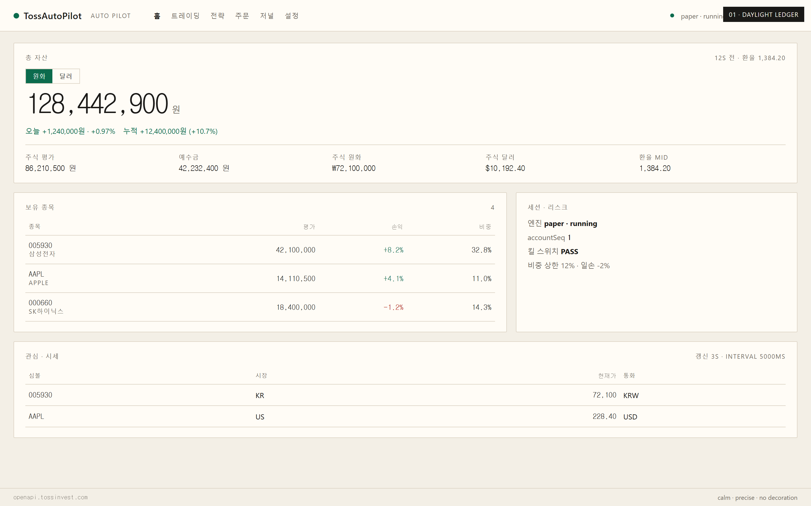
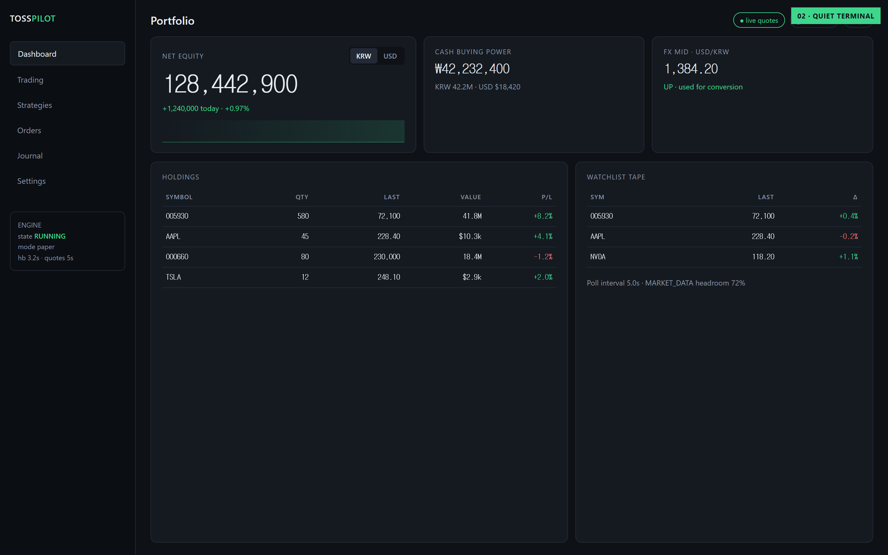
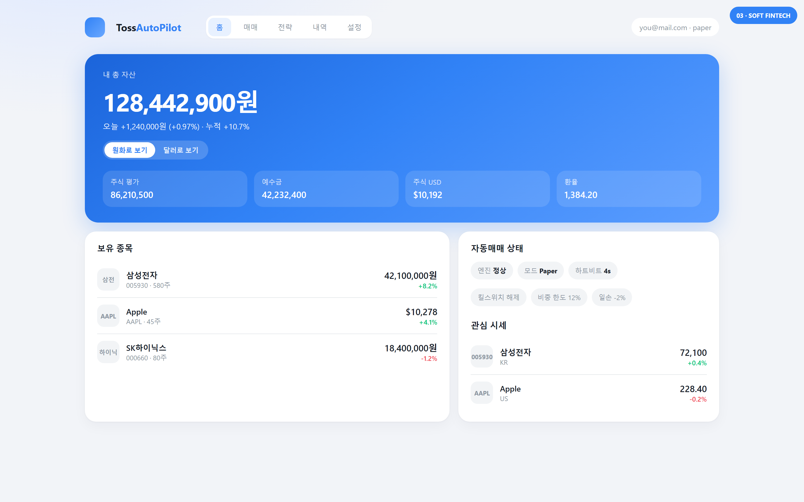
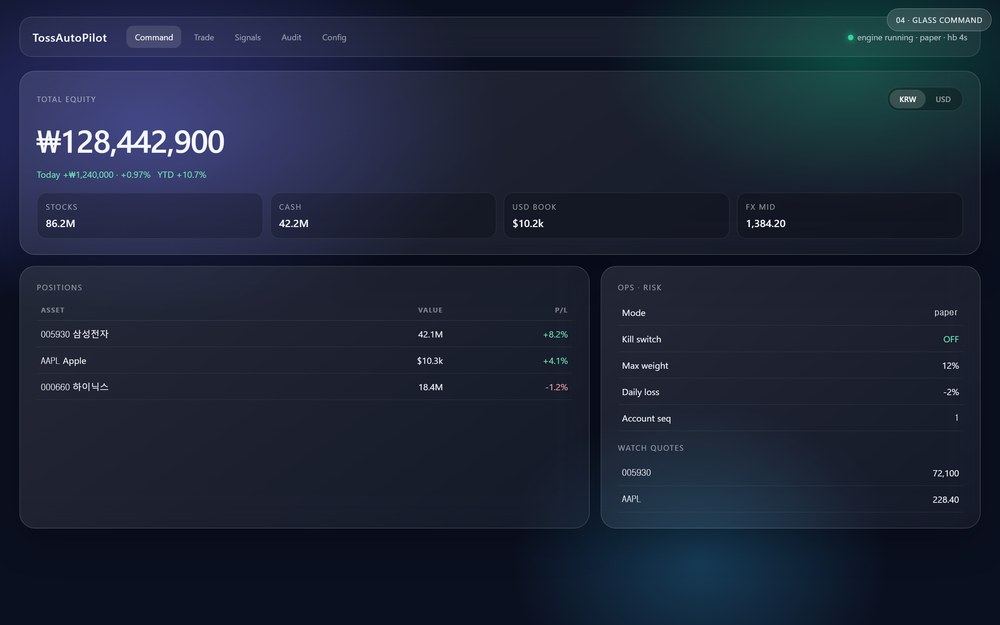
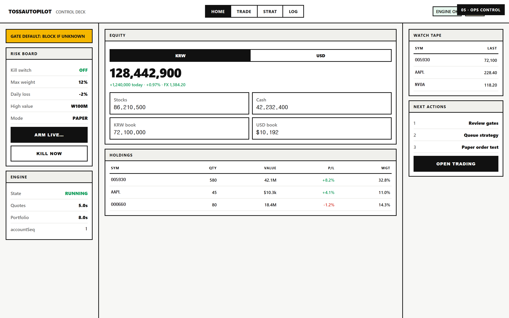
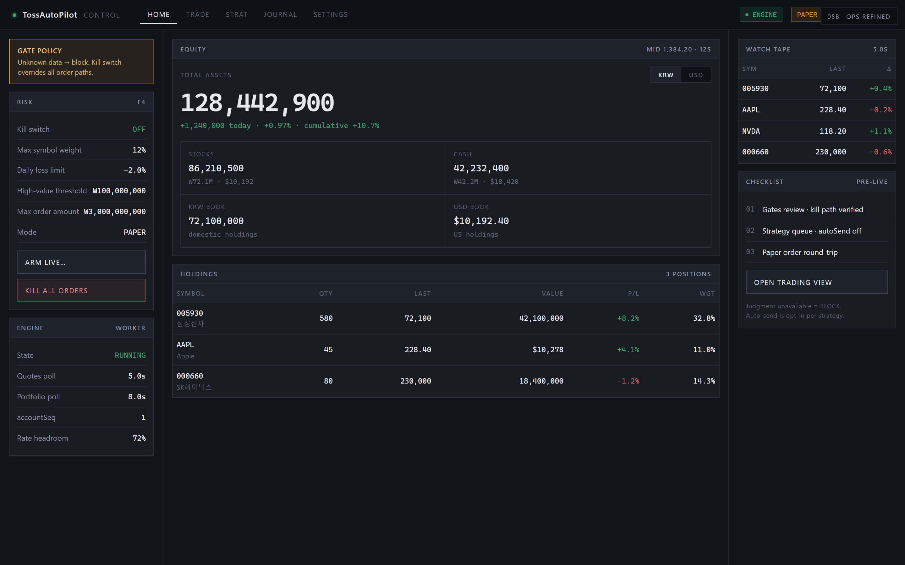

# TossAutoPilot 대시보드 UI 시안 5종

| 문서 | 2026-08-09 |
|---|---|
| 목적 | 자동매매 관제 홈을 더 트렌디하게 재디자인하기 위한 방향 선택 |
| 공통 정보 | 총자산 · 예수금 · 통화 토글 · 보유 · 관심시세 · 엔진/리스크 상태 |
| HTML | `docs/design/mockups/` |
| 스크린샷 | `docs/design/screenshots/` |

---

## 스크린샷

### 01 · Daylight Ledger（현재 철학 진화）



| | |
|---|---|
| **톤** | 웜 페이퍼 · 절제된 계기판 |
| **강점** | 숫자 가독성, 금융 신뢰, 기존 Instrument Grammar 계승 |
| **약점** | “트렌디함”은 약함 — 안정·정직 쪽 |
| **추천 상황** | 실계좌·리스크 메시지를 가장 진지하게 전달할 때 |

---

### 02 · Quiet Terminal（다크 터미널）



| | |
|---|---|
| **톤** | 미드나잇 다크 · 모노 숫자 · 사이드 네비 |
| **강점** | 트레이더 친화, 밀도 높음, 장시간 시인성 |
| **약점** | 초심자·모바일 약함 |
| **추천 상황** | 트레이딩/전략 모드를 홈과 동일 셸로 밀 때 |

---

### 03 · Soft Fintech（토스·핀테크 감성）



| | |
|---|---|
| **톤** | 라운드 카드 · 블루 히어로 · 소프트 섀도 |
| **강점** | 가장 “요즘 앱” 느낌, 온보딩·신뢰 진입 쉬움 |
| **약점** | 장식·그라데이션이 과하면 계기판 진지함이 희석 |
| **추천 상황** | 소비자형 SaaS 첫인상 · 모바일 관제 확장 |

---

### 04 · Glass Command（글래스 · 커맨드）



| | |
|---|---|
| **톤** | 글래스모피즘 · 그라데이션 공간 · 플로팅 패널 |
| **강점** | 비주얼 임팩트, 프리미엄 “컨트롤룸” |
| **약점** | 가독성·접근성 관리 비용, 숫자 대비 주의 필요 |
| **추천 상황** | 마케팅 랜딩/데모 셸 (운영 기본 UI로는 2순위) |

---

### 05 · Ops Control Deck（운영 통제실 · 초안）



| | |
|---|---|
| **톤** | 고대비 보더 · 3열 운영 덱 · 킬/게이트 전면 |
| **강점** | 안전장치·상태가 가장 잘 보임, 자동매매 철학과 직결 |
| **약점** | 네오브루탈 톤이 **귀엽/장난감**처럼 읽힐 수 있음 |
| **추천 상황** | 구조 참고용 · 비주얼은 05b 권장 |

---

### 05b · Ops Control Refined（리파인）



| | |
|---|---|
| **톤** | 다크 관제 · 1px 라인 · 모노 숫자 · 얇은 앰버 경고 레일 |
| **조정** | 두꺼운 검정 테두리·노란 블록 배너·청크 버튼 제거 |
| **유지** | 3열(Risk / Equity / Tape) · Kill/Arm · 게이트 정책 문구 |
| **강점** | 통제실 구조 + 실계좌에 맞는 차가운 인상 |
| **추천 상황** | **05 계열 채택 시 기본 시안** |

---

## 비교 한 장

| # | 이름 | 트렌디 | 신뢰/안전 | 정보 밀도 | 구현 난이도 |
|---|---|:---:|:---:|:---:|:---:|
| 01 | Daylight Ledger | ★★ | ★★★★★ | ★★★★ | 낮음 |
| 02 | Quiet Terminal | ★★★★ | ★★★★ | ★★★★★ | 중 |
| 03 | Soft Fintech | ★★★★★ | ★★★ | ★★★ | 중 |
| 04 | Glass Command | ★★★★★ | ★★ | ★★★ | 중~높음 |
| 05 | Ops Control (초안) | ★★★ | ★★★★★ | ★★★★★ | 중 · 귀여움 리스크 |
| 05b | Ops Refined | ★★★★ | ★★★★★ | ★★★★★ | 중 |

---

## 제품 목적에 맞는 권장

**TossAutoPilot = 실계좌 자동매매 관제** 이므로:

1. **기본 셸 추천: `03 Soft Fintech` × `01 Daylight` 하이브리드**  
   - 카드 라운드·여백·히어로 총자산은 Soft  
   - 숫자 정렬·위험 카피·과도한 장식 금지는 Daylight  
2. **트레이딩 모드: `02 Quiet Terminal`** (고밀도 화면만 다크)  
3. **Live/킬 순간 강조: `05 Ops`의 배지·킬 버튼 패턴만 차용**  
4. **04 Glass는 랜딩/데모용 선택** — 운영 홈 기본은 비권장  

---

## 파일 경로

```
docs/design/
  DASHBOARD_MOCKUPS.md          ← 이 문서
  mockups/
    01-daylight-ledger.html
    02-quiet-terminal.html
    03-soft-fintech.html
    04-glass-command.html
    05-ops-control.html
    05b-ops-control-refined.html
  screenshots/
    01-daylight-ledger.png
    02-quiet-terminal.png
    03-soft-fintech.png
    04-glass-command.png
    05-ops-control.png
    05b-ops-control-refined.png
  capture-mockups.mjs           ← 재캡처 스크립트
```


재캡처:

```bash
node docs/design/capture-mockups.mjs
```

---

## 적용 상태

| 시안 | 상태 |
|---|---|
| **05 Ops Control Deck** | **채택 · 웹 홈 UI 반영** (`apps/web` globals + 3-col layout) |
| 05b Refined | 참고용 보관 (미적용) |

---

## 다음

시안 05 기준으로 컴포넌트·카피 다듬기, Trade/Strat 화면 확장.
